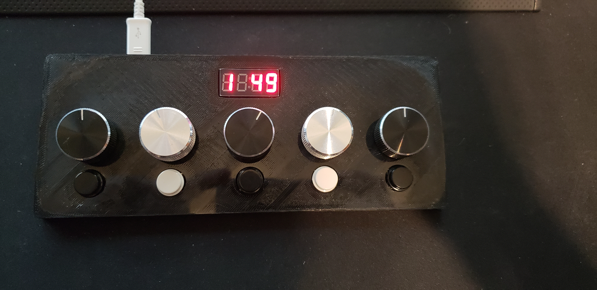
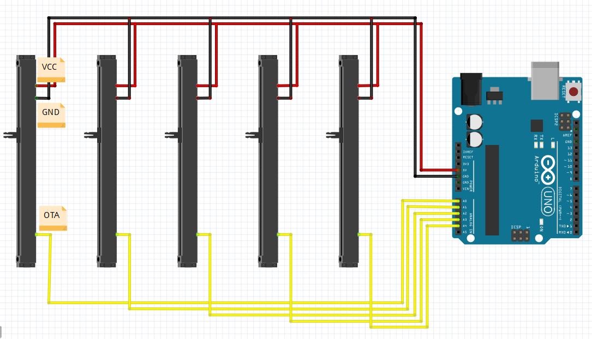

# deej

Arduino project for controlling audio volume for separate Windows processes using physical sliders (like a DJ!)

[**Video demonstration (click here)**](https://youtu.be/VoByJ4USMr8)



## How it works

### Hardware

- The sliders are connected to 5 analog pins on an Arduino Uno board. They're powered from the board's 5V output (see schematic)
- The board connects via a USB cable to the PC

#### Schematic



### Software

- The code running on the Arduino board is a C program constantly writing current slider values over its Serial interface [`deej-arduino.ino`](./deej-arduino.ino)
- The PC runs a Python script [`deej.py`](./deej.py) that listens to the board's Serial connection, detects changes in slider values and sets volume of equivalent audio sessions accordingly.
- A VBScript-based run helper [`run.vbs`](./run.vbs) allows this Python script to run in the background (from the Windows tray).

## Slider mapping

A configuration is passed to the `Deej` object as follows:

```python
    deej = Deej({
        'slider_mapping': {
            0: 'master',
            1: 'chrome.exe',
            2: 'spotify.exe',
            3: [
                'pathofexile_x64.exe',
                'rocketleague.exe',
            ],
            4: 'discord.exe',
        },
        'process_refresh_frequency': 5,
    })
```

- Process names aren't case-sensitive
- You can use a list of process names to either:
    - define a group that is controlled simultaneously
    - choose whichever process in the group is currently running (in this example, one slider is for different games that may be running)
- `master` is a special option for controlling master volume of the system.
- The `process_refresh_frequency` option limits how often `deej` may look for new processes if their appropriate slider moves. This allows you to leave `deej` running in background and open/close processes normally - the sliders will #justwork

## How to run

If you've actually gone ahead and built yourself this kind of box, here's how you can run `deej`:

### Requirements

- Python 2.7.x (Sorry!) and `pip`
- `virtualenv`

### Installation

- Download the repository by either cloning it or downloading its archive.
- In the repo's directory, run:
    - `virtualenv venv`
    - `venv\Scripts\activate.bat`
    - `pip install -r requirements.txt`
- Make a shortcut to `run.vbs` by right-clicking it -> "Create Shortcut"
- (Optional, but mandatory) Change the shortcut's icon to `assets/logo.ico`
- (Optional, but optional) Copy the shortcut to `%APPDATA%\Microsoft\Windows\Start Menu\Programs\Startup` to have `deej` run on boot

## Missing stuff

- Exterenal configuration and auto-reload when it changes
- Better logging and error handling
- Automatic COM port detection
