# Community showcase

This is a showcase of `deej` versions built by people around the world. Many of those who featured their builds here regularly hang around in [our Discord server](https://discord.gg/nf88NJu), so you can ask them any questions you might have.

We've also gathered many of the community-created 3D designs featured here in a [Thingiverse collection](https://thingiverse.com/omriharel/collections/deej) for your viewing pleasure. Feel free to use them for your own builds if you have access to a 3D printer.

If you built yourself one of these things, I'd love to [add yours](https://discord.gg/nf88NJu)!

## [/u/Aithorn](https://reddit.com/user/Aithorn)

**Links**: [Imgur album](https://imgur.com/a/Y1rKJmc) | [Reddit](https://redd.it/fc2l3x) | [Enclosure model on Thingiverse](https://www.thingiverse.com/thing:4196719) | [Featured on Arduino Blog!](https://blog.arduino.cc/2020/03/04/control-the-volume-of-programs-running-on-your-windows-pc-like-a-dj/) | [Alternate knobs](https://i.imgur.com/WjaA58d.jpg)

This build features a very neat 3D-printed enclosure to fit the sliders, and uses an Arduino Nano board.

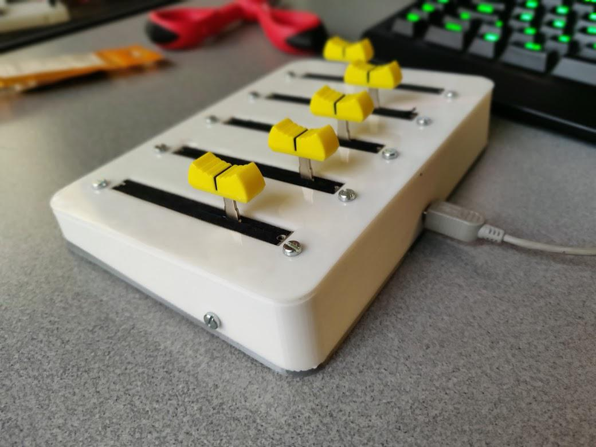

## [Bupher](https://github.com/Bupher)

**Links**: [Imgur album](https://imgur.com/a/5uHYhxW) | [Enclosure model on Thingiverse](https://www.thingiverse.com/thing:4641048) | [GitHub fork](https://github.com/Bupher/deej) | [Video 1](https://youtu.be/O2UJv-sJEjA) | [Video 2](https://youtu.be/psEt-rckr8U)

This updated build uses circular knobs instead of sliders, and adds a 7-segment display showing the volume of the last adjusted knob. The five buttons are used to trigger various macros that the author configured separately. Most recently this build was augmented to include built-in support for Corsair's iCUE RGB control. This allows using Corsair's desktop software to control the lighting on this deej design similarly to an RGB keyboard. The required Arduino-side code modifications are available in Bupher's fork (link above). Very cool!

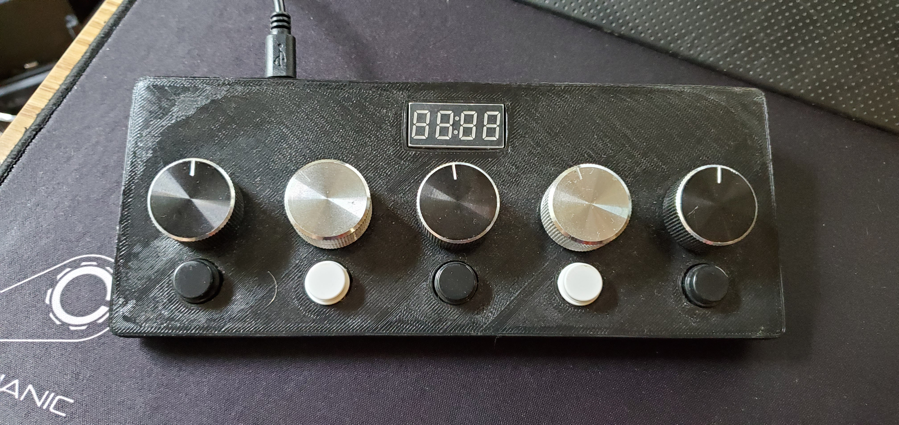

## Dimitar

**Links**: Schematic ([.png](./assets/community-builds/extra/dimitar-schematic.png) | [.sch](./assets/community-builds/extra/dimitar-schematic.sch))

This build, based on the above 3D-printed enclosure by [/u/Aithorn](#uaithorn), adds onto it with additional holes drilled for fading LEDs and mute toggles. Their wiring is detailed in the schematic that Dimitar has kindly provided (link above).. The sleek dark appearance, coupled with the differently colored knobs and LEDs, makes for a very professional look.

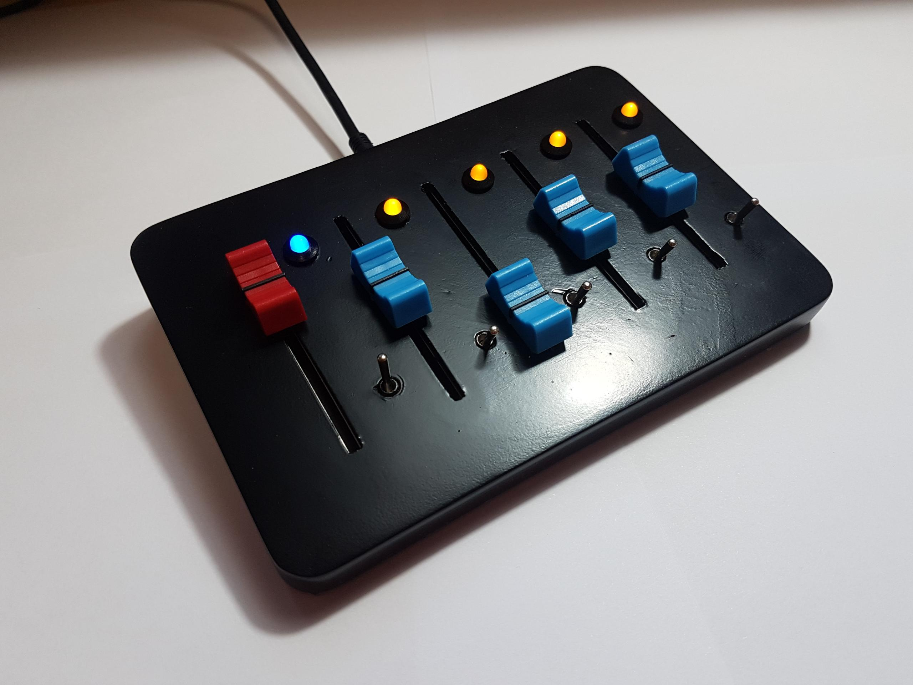

## [/u/jeremytodd1](https://reddit.com/user/jeremytodd1)

**Links**: [Imgur album](https://imgur.com/a/ys1RLwr)

This build is based on the above 3D-printed enclosure by [/u/Aithorn](#uaithorn) and also uses their 3D-printed knobs for its sliders.

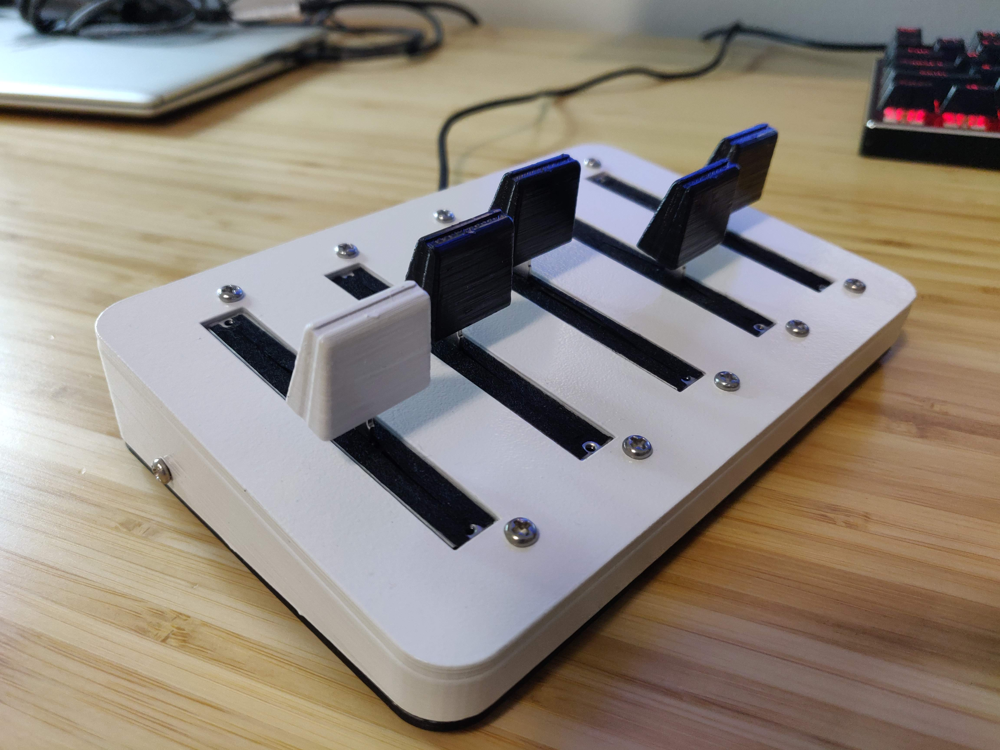

## CptnObvious

**Links**: [Imgur album](https://imgur.com/a/pnptoo7)

This build uses a flat 3D-printed enclosure, but the real kicker is its magnetically-snapping application logo covers, made with a midway-filament-swapping technique. Looking snappy!

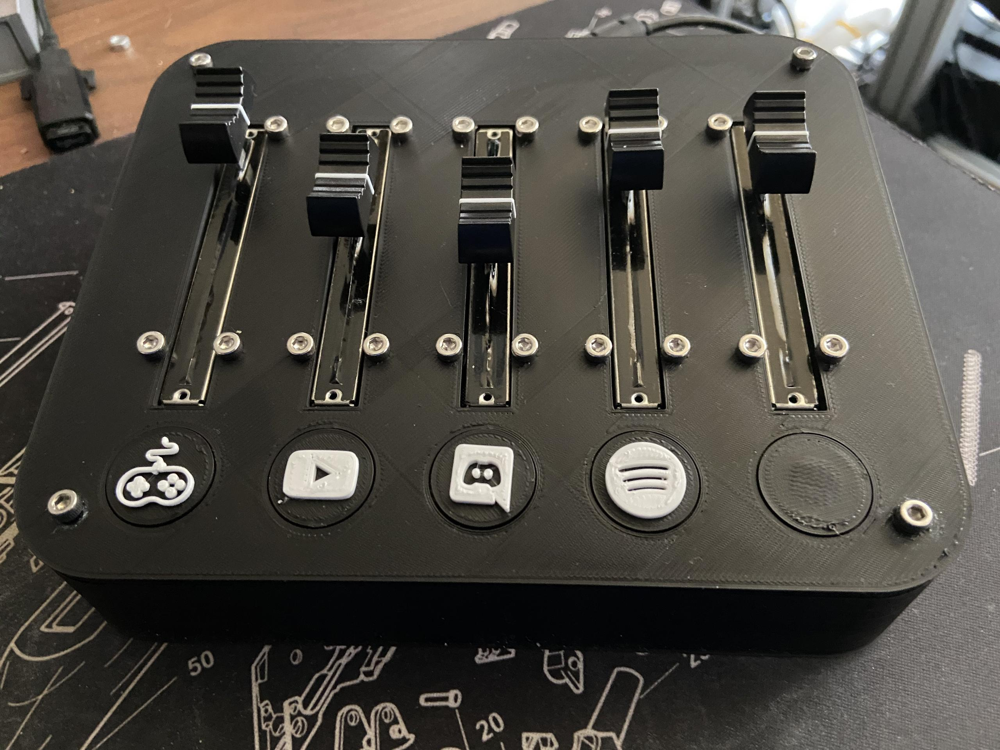

## nightfox939

**Links**: [Imgur album](https://imgur.com/a/rrLbTHI) | [Enclosure model on Thingiverse](https://www.thingiverse.com/thing:4460296)

This build takes a different spin on 3D-printed enclosures by positioning the sliders at an angle, such that the box can be placed right behind the keyboard (as shown [here](https://i.imgur.com/FuvaaTO.jpg)). It also features seven sliders, which is fantastic for power users.

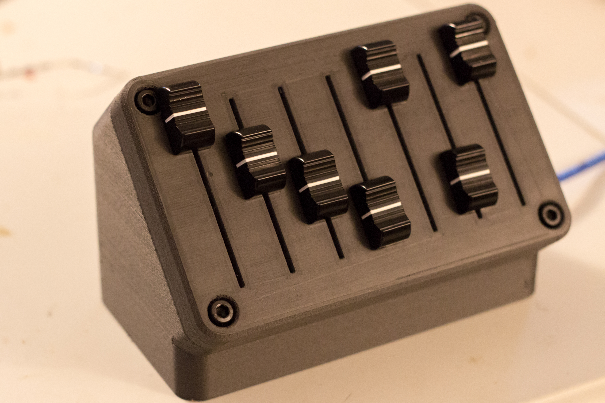

## [Snackya](https://github.com/Snackya)

**Links**: [Imgur album](https://imgur.com/a/ZL6UBuR) | [GitHub repository with PCB files and instructions](https://github.com/Snackya/Snackboard-mix)

This one's a very special build, as it's designed to look great with absolutely no 3D printing, mill or any casing at all. It's made with custom PCBs that are mounted together with bolts and nuts. The top plate's silkscreen layer adds its own visual flair. The build uses six 100 mm sliders and an Arduino Pro Micro. Snackya has kindly provided the gerber files, as well as detailed instructions, in their GitHub repository (link above).

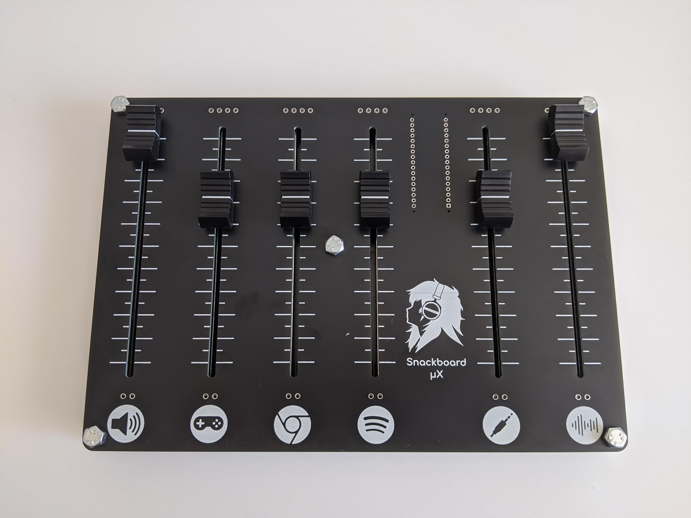

## [olijoe](https://github.com/olijoe)

**Links**: [Imgur album](https://imgur.com/a/Wibnqi7) | [GitHub repository with PCB files and instructions](https://github.com/olijoe/Deej-board)

This PCB build also takes advantage of sandwiching between two identical custom PCBs to avoid any need for 3D printing or other tools. Both sides of the PCB are used, one for mounting and wiring the components and the other for the silkscreen design (which in this case features some app logos and a cute geometric alpaca). olijoe has kindly provided the gerber files, as well as detailed insturctions, in their GitHub repository (link above).

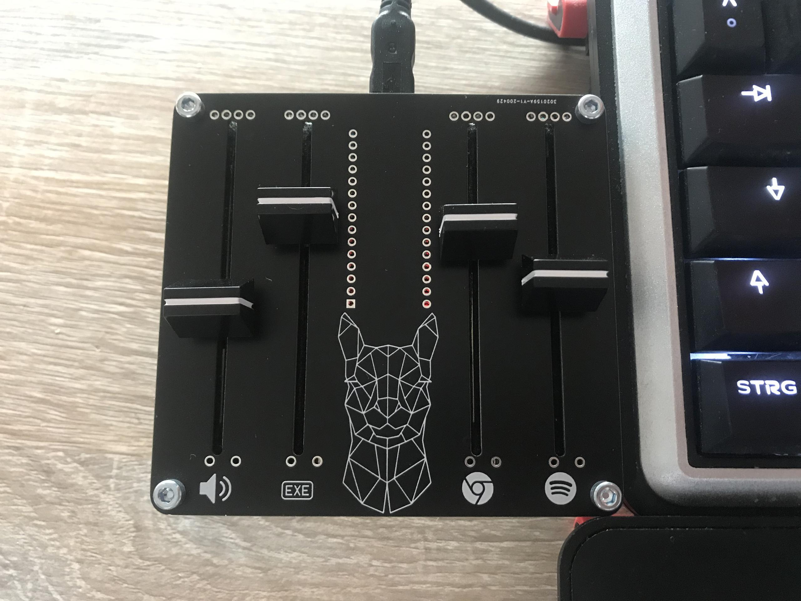

## [Daggr](https://www.thingiverse.com/daggr)

**Links**: [Imgur album](https://imgur.com/a/YmTALay) | [Enclosure model on Thingiverse](https://www.thingiverse.com/thing:4555424) | [Blog post](https://blogg.spofify.se/index.php/2020/07/28/physical-volume-controller-part-2/)

This design is a remixed version of the above build by [nightfox939](#nightfox939), this time using five circular knobs instead of sliders. It adds onto it with a patterned top infill in the slicer settings, as well as some sharp looking filament-swapped app icons.

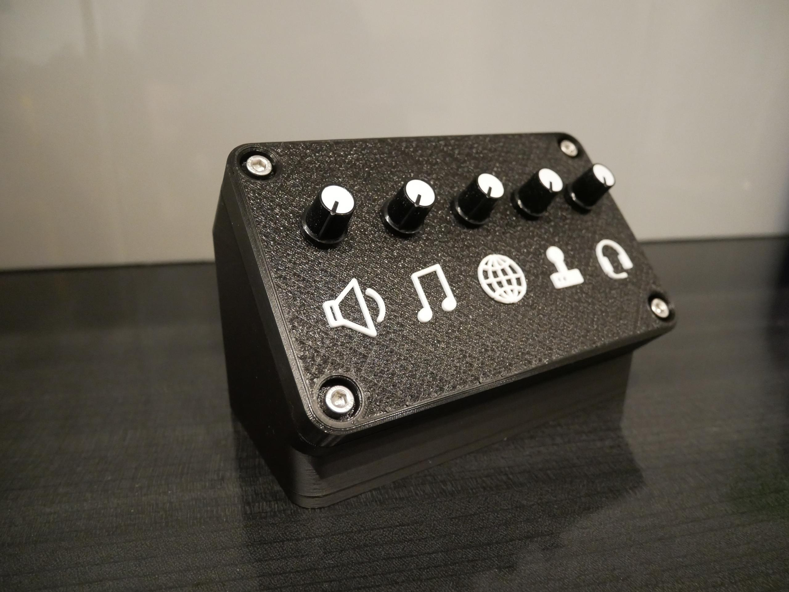

## [/u/thesqueakywheel](https://reddit.com/user/thesqueakywheel)

**Links**: [Imgur album](https://imgur.com/a/vTsrSa7) | [Enclosure model on Thingiverse](https://www.thingiverse.com/thing:4557639)

This one's a compact 3-part design made to be [mounted to the underside of a desk](https://i.imgur.com/hGB5NH2.png). Each part is flat to allow for easy 3D printing without support material. The design is made such that the mounting plate in-between the two covers is actually what's holding them together and hidden between them for a seamless packaging.

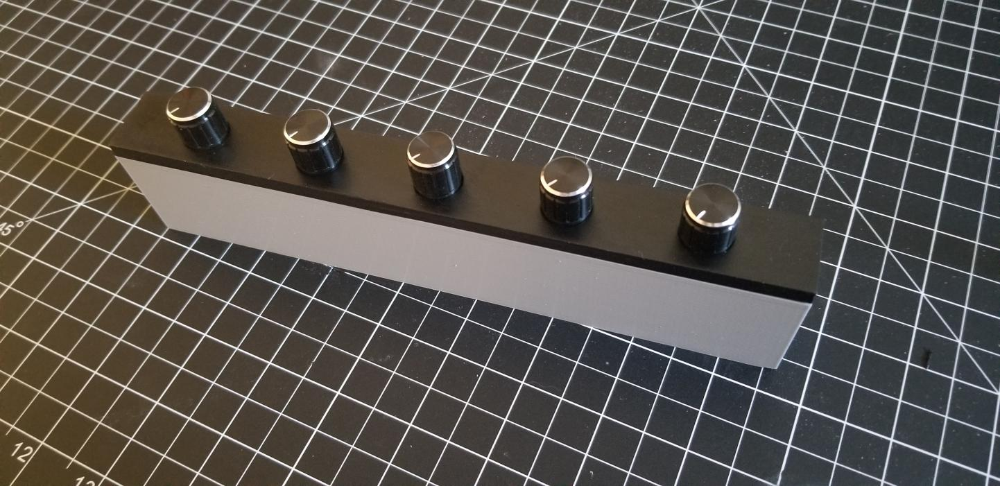

## [Optagon](https://www.thingiverse.com/Optagon)

**Links**: [Imgur album](https://imgur.com/a/8WKr8W9) | [Enclosure model on Thingiverse](https://www.thingiverse.com/thing:4556291)

This design incorporates fading LEDs that shine through 3D-printed app icons (they look way better in reality, but hopefully the picture gives a bit of an idea). Instructions for how to wire everything up, including some pictures, are inside the links above. A bright idea, and some very stylish execution!

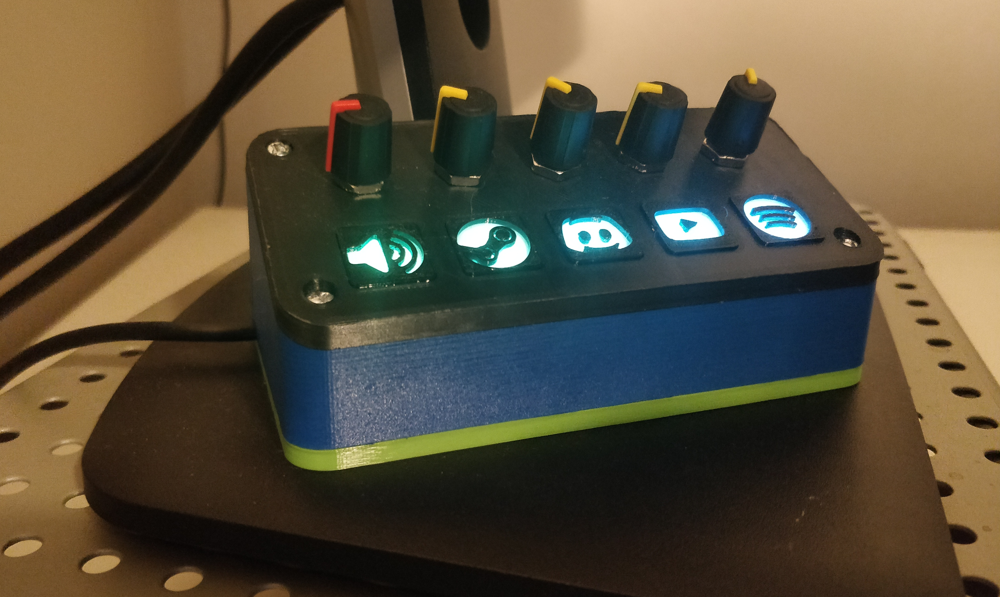

## mozza

**Links**: [Imgur album](https://imgur.com/a/suMAJ5Y) | [Enclosure model on Thingiverse](https://www.thingiverse.com/thing:4558424)

This compact build was designed to be positioned side-by-side with a keyboard. Contrary to most other designs, the knobs here are laid out vertically, making ideal use of the space they occupy. Perfect for a quick adjustment without ever taking off your hand from that side of the keyboard! Oh, and there's a similar version by the same author [below](#mozza-v2) if you're interested.

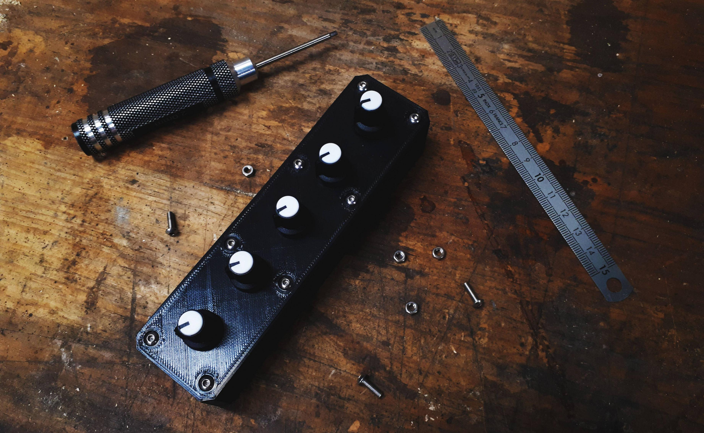

## Max

**Links**: [Imgur album](https://imgur.com/a/T8OR4b3) | [Enclosure model on PrusaPrinters](https://www.prusaprinters.org/prints/37823-deej-mixer)

This build uses laser-cut acrylic as for its top plate which results in an absolutely stunning shine. It's lined with LEDs to indicate mute state, controllable by one of the two rows of buttons. The second row is used as custom triggers for F13-F19 keys, which brings a lot of added utility. This one's definitely for power users!

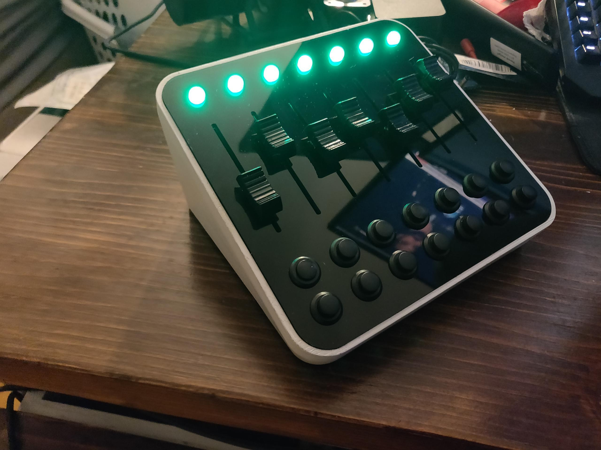

## [/u/functionalism](https://reddit.com/user/functionalism)

**Links**: [Imgur album](https://imgur.com/a/zavi9jL) | [Enclosure model on Thingiverse](https://www.thingiverse.com/thing:4561669)

This build uses a 3D-printed design remixed from [/u/Aithorn](#uaithorn)'s above enclosure. This one was made to be held in place by magnets, as it's situated on top of a metallic monitor stand. Magnets are also used instead of screws to hold the top cover and the enclosure's base together. In addition, app icons have been embossed into the 3D-printed slider knobs.

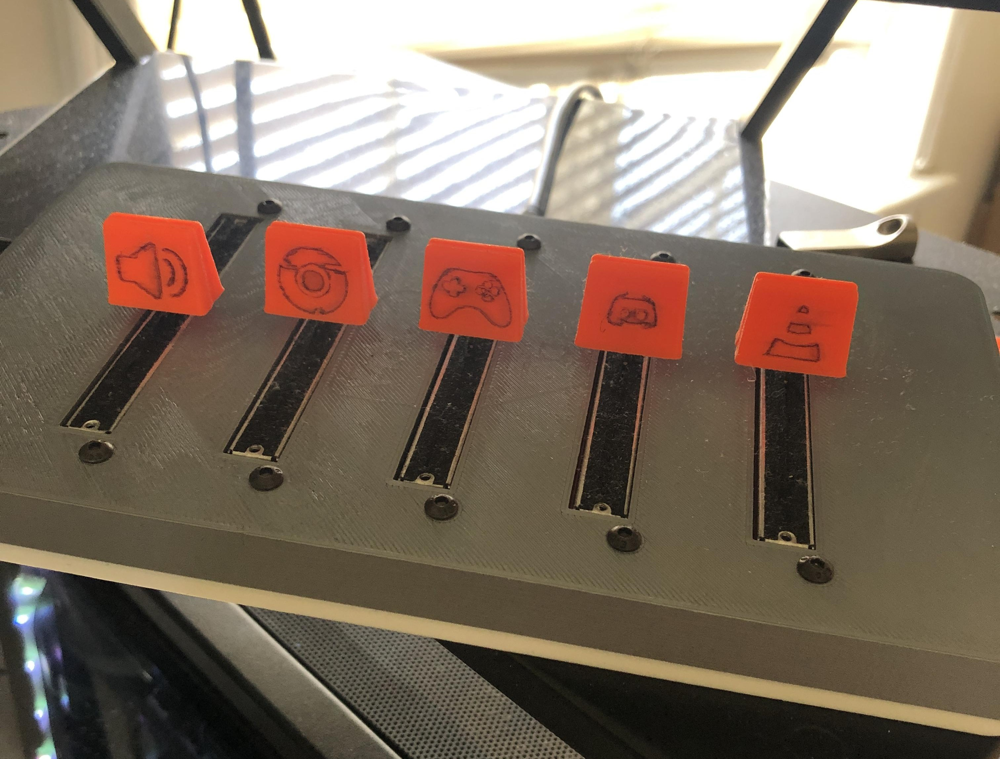

## [/u/Fantastic-Feature-84](https://reddit.com/user/Fantastic-Feature-84)

**Links**: [Imgur album](https://imgur.com/a/1q2MYI1) | [Enclosure model on Thingiverse](https://www.thingiverse.com/thing:4562009) | [Full Instructable](https://www.instructables.com/id/Hardware-Volume-Mixer-for-PC-With-RGB-LEDs)

This clever retro-style design features LEDs that change their color based on each slider's volume. These LEDs shine through light diffusers mounted below icon cutouts for the different apps, providing a controlled brightness that's easy on the eyes. In addition, a satisfying push button provides global mute toggling. /u/FantasticFeature84 has kindly provided full instructions for anyone else who wishes to build the same box, available on Instructables (link above).

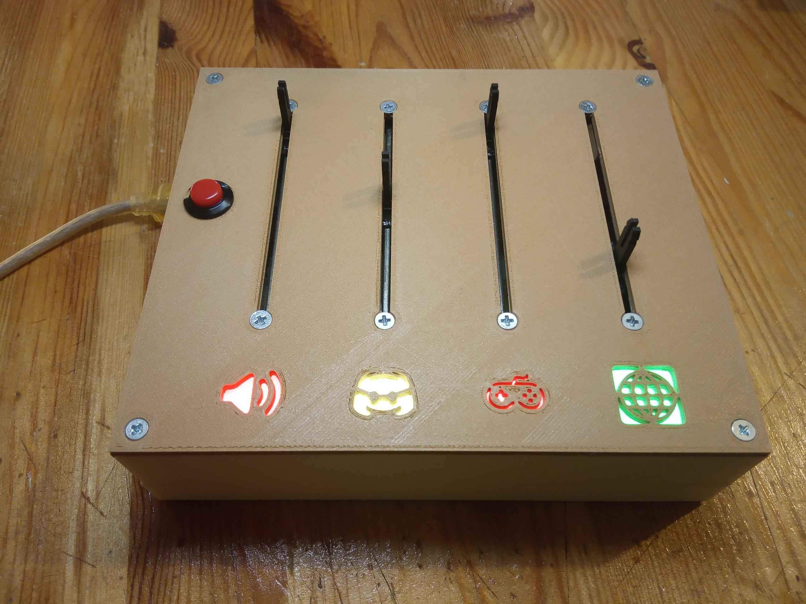

## [Cole Morris](http://colemorris.me)

**Links**: [Imgur album](https://imgur.com/a/qkSlVGt)

This compact 3D-printed build makes clever use of vertical space by having slight dips along each slider's travel area, making the knobs seem more integrated with the rest of the enclosure. The bright colors used for its different parts compliment each other well, and band together with its form factor and rounded edges to create a cute, toy-like appearance.

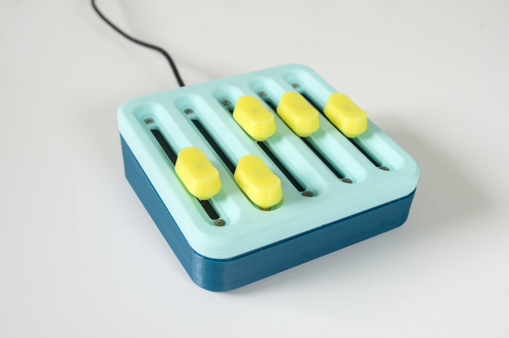

## [wshaf](https://www.twitch.tv/wshaf)

**Links**: [Imgur album](https://imgur.com/a/KWONZ5A) | [Build VOD on Twitch](https://www.twitch.tv/videos/704168677)

This is a pink-and-black rendition of [/u/Aithorn](#uaithorn)'s above build, built by the author for one of their friends. Its primary use will be to control different audio sources while live-streaming on Twitch, which highlights deej's usefulness as a cheap DIY alternative to GoXLR and other similar products.

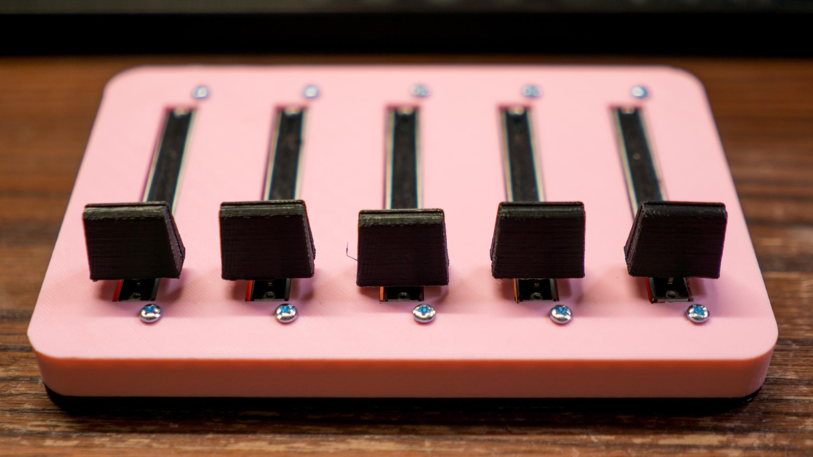

## scotte

**Links**: [Imgur album](https://imgur.com/a/Wj2Fe5w) | [Enclosure model on Thingiverse](https://www.thingiverse.com/thing:4567647)

This one is a super-compact mini design! It features a 2-part snap-fit 3D-printed case, as well as 3D-printed knobs. With a total of three sliders and a tiny footprint of about 45 by 75 millimeters, this mini deej version is perfect for those looking to balance fewer audio sources and save some precious desk space. Did we mention it's adorable?

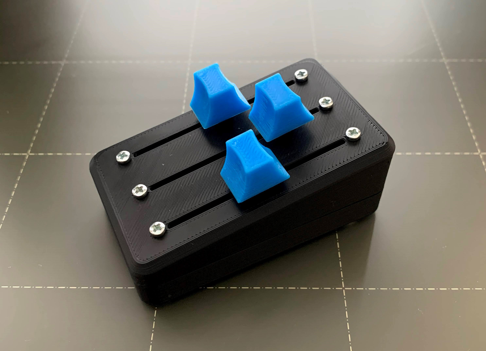

## [Ginjah](https://www.twitch.tv/ginjah_)

**Links**: [Enclosure model on Thingiverse](https://www.thingiverse.com/thing:4569860)

This slanted, 3D-printed design consists of six potentiometers - five of them are sliders, and a large knob is used as a master volume control. It features buttons with built-in LEDs to indicate mute toggle state, with one button acting specifically as a global mute (which is the equivalent of turning down all sliders to zero) - this accomplishes muting applications across several audio devices as opposed to just `master` which uses the default. Also worth mentioning that the knob and slider caps are all 3D-printed too!

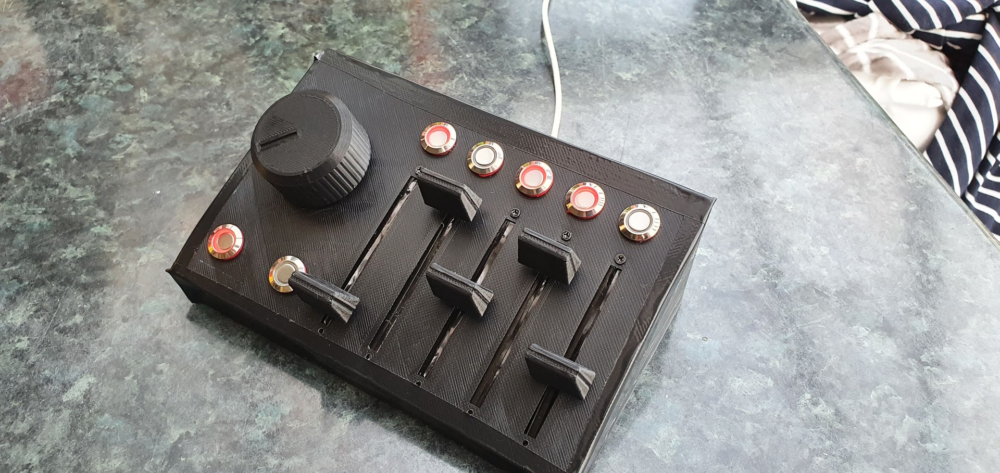

## mozza (v2)

**Links**: [Enclosure model on Thingiverse](https://www.thingiverse.com/thing:4570471)

This build is a follow up to the earlier version made by mozza ([showcased above](#mozza)). It features a combination of four sliders and one master volume knob. It was designed to match the same angle as the keyboard that's next to it. In addition to that, many rounds of sanding and filling have resulted in a professional surface finish that looks like an actual product.

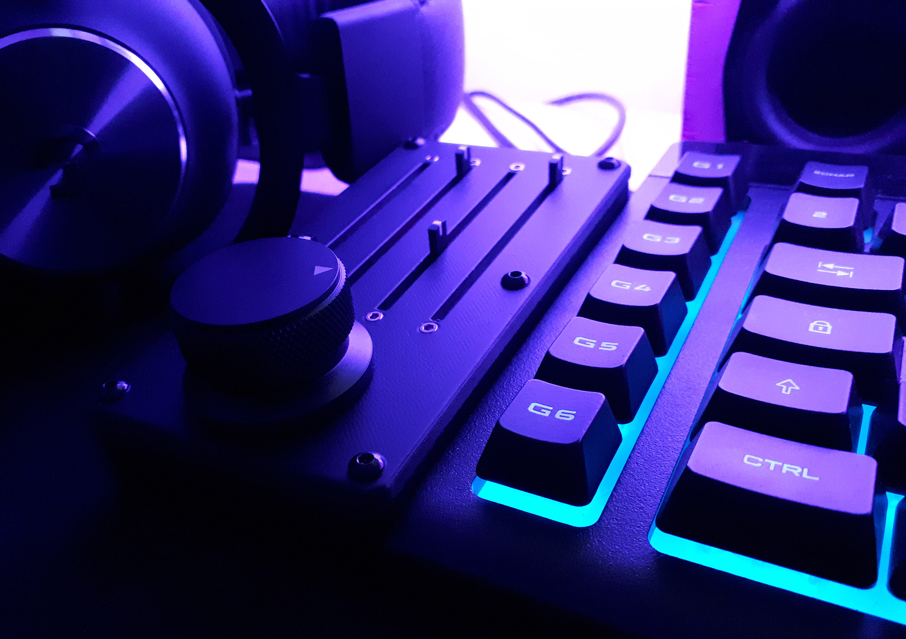

## Probird

This simple build consists of five knobs with, wait for it - **2D**-printed app icons attached to its top surface (yes, it's a piece of paper and some glue). This is a good example for a design that users who are brand new to 3D-printing and CAD can make entirely from scratch.

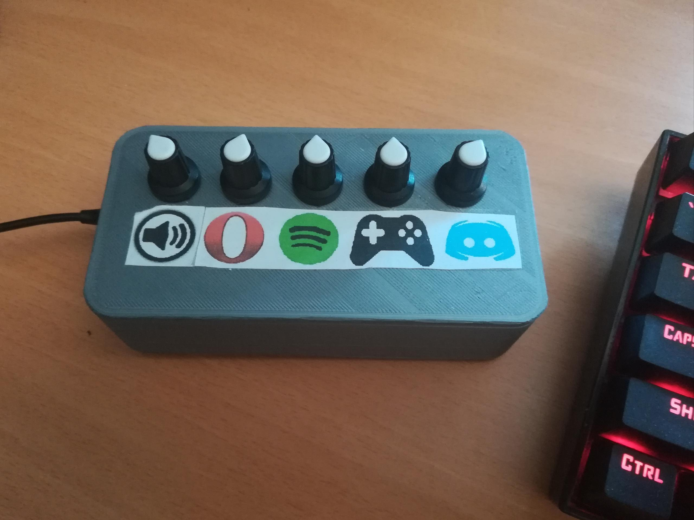

## [/u/DruciferRedBeard](https://reddit.com/user/DruciferRedBeard)

**Links**: [Imgur album](https://imgur.com/a/nBGLd9b) | [Enclosure model on Thingiverse](https://www.thingiverse.com/thing:4568300)

This wonderfully colorful build was made [twice](https://i.imgur.com/v3FQXkF.jpg) by its author, one for themselves and one for their son.  It's a clever 3D-printed design featuring no visible screws on its top surface, achieved by mounting a stabilizer in-between the top and bottom covers. The knobs have also been printed out with a satisfying range of colors (meant to represent different apps). The indicator line down the middle of each slider is made using the "color change" feature in PrusaSlicer. Elegant _and_ cheerful!

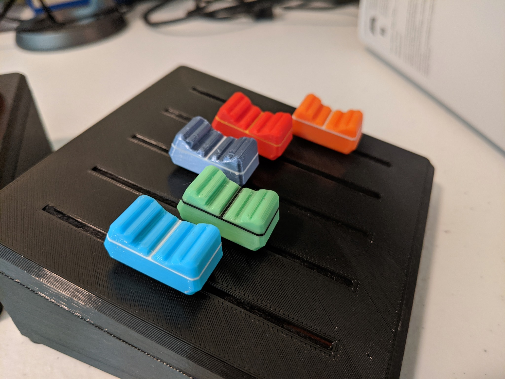

## Snaglebagle

**Links**: [Imgur album](https://imgur.com/a/QN7gyjP) | [Enclosure model on Thingiverse](https://www.thingiverse.com/thing:4579910)

This bright, red and black design has a neat retro look to it that's further complemented by its sharp corners. It has five sliders and uses the 3D-printed knobs designed by [/u/Aithorn](#uaithorn).

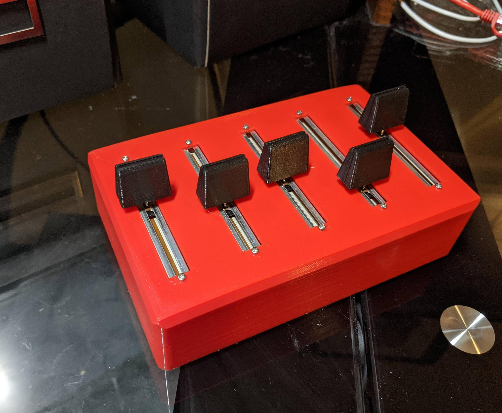

## [/u/Kawaru86](https://reddit.com/user/Kawaru86)

**Links**: [Imgur album](https://imgur.com/a/q2fENDF)

This unique build is based entirely on a breadboard! Two, to be exact. The author took some great pictures that [show the wiring](https://i.imgur.com/hUHCKup.jpg) for the project in a very clear (and quite satisfying) way. This is a fantastic, [stylish](https://i.imgur.com/2ETrBIE.jpg) choice for people without access to a 3D printer, or those looking for a way to build deej without soldering anything.

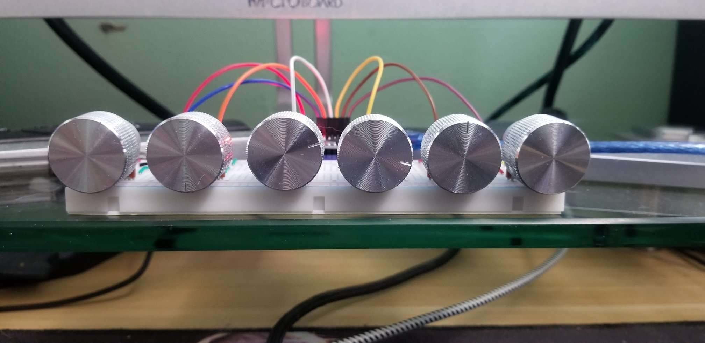

## [/u/HumidLettuce](https://reddit.com/user/HumidLettuce)

**Links**: [Imgur album](https://imgur.com/a/AEpAJYi) | [Enclosure model on Thingiverse](https://www.thingiverse.com/thing:4580787) | [Full Instructable](https://www.instructables.com/id/Deej-Box-5-Sliders/)

This 3D-printed design has a smooth surface finish and features no front-facing screws. It uses magnetic, swappable plates with app icons below each slider, allowing you to easily tell which slider controls which app. In addition, the steep angle of this build lets it occupy slightly less desk space than other, more traditional slider-based designs. /u/HumidLettuce has kindly provided full, step-by-step build instructions for other users wishing to use this design, available on Instructables (link above).

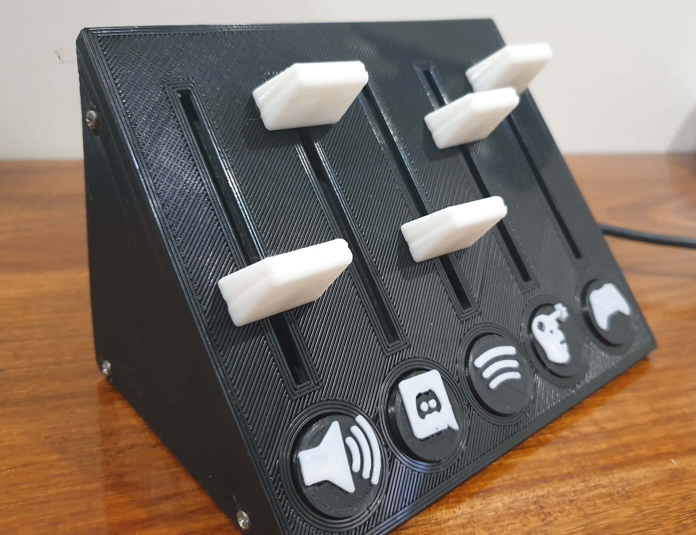

## [Snow](https://reddit.com/user/NoU_14)

**Links**: [Imgur album](https://imgur.com/a/3XYqhJk)

This compact design uses a single rotary encoder (with a modified version of deej's Arduino code) that acts as several "virtual" knobs. Clicking the encoder toggles the control between them, with the active channel (and current volume level) being indicated by the OLED screen. It also incorporates an LED ring to act as a secondary volume level indicator, adding some visual flair to the build. The 3D-printed enclosure wraps everything up with a professional look, that (unintentionally!) somewhat resembles a classic iPod. The bottom side of the enclosure is filled with some plaster, giving it additional weight and allowing it to remain sturdy despite its small (8x4.5x2.3 cm) size.

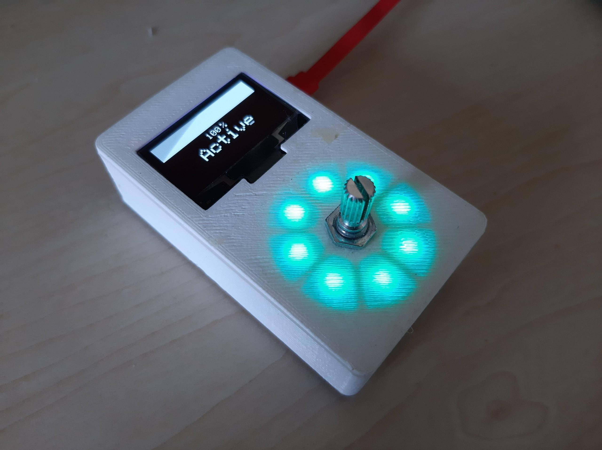

## YaMoef

**Links**: [Imgur album](https://imgur.com/a/3zxhjxF) | [Modified code on GitHub](https://github.com/YaMoef/deej)

This build presents a second, angled variation on the single rotary encoder approach, using a single component to control multiple "virtual sliders". It uses a heavily modified version of both Arduino code and the deej client (both of which the author has kindly made available in their GitHub fork, alongside detailed instructions - link above). It features an LCD display to indicate the active channel as well as the current volume level. Its 3D-printed exterior is finished off with a shiny, metallic volume knob to wrap up its sleek appearance.

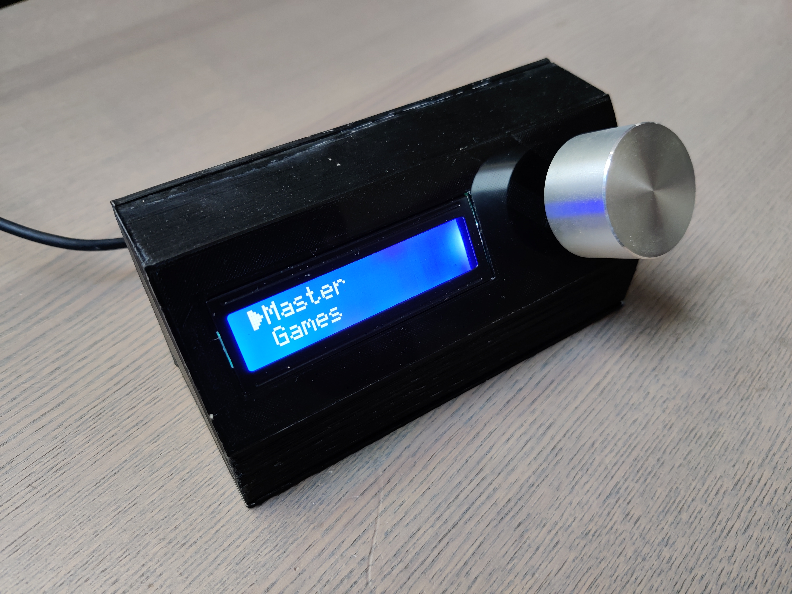

## StalkyMuffin

**Links**: [Imgur album](https://imgur.com/a/zmfc3ft) | [Enclosure model on Thingiverse](https://www.thingiverse.com/thing:4595058)

This one is a traditional-looking slider-based build with some unique properties. It was designed with multi-material capabilities in mind, most notably apparent by the laser-cut wooden app glued to the top. These provide an interesting contrast to the multi-layered faceplate, printed with two different filaments to give the sliders their own highlight. It's also the first deej build to include a [cord strain relief](https://i.imgur.com/lK6twPm.jpg) instead of a USB port, which adds to its highly professional look and feel.

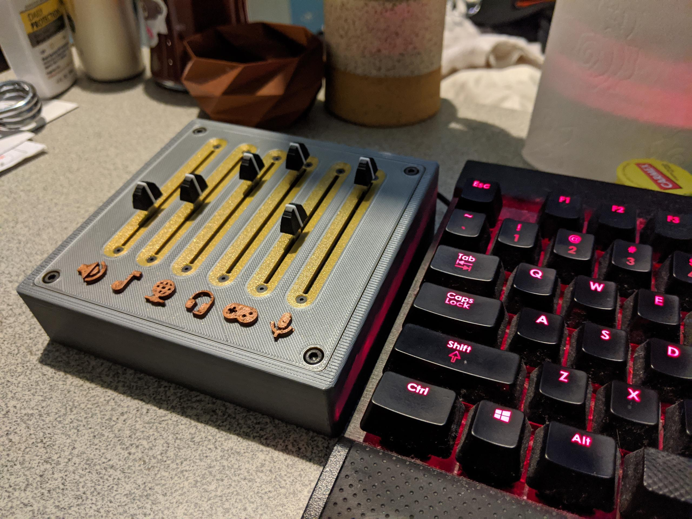

## [ocyrus99](https://www.thingiverse.com/ocyrus99)

**Links**: [Imgur album](https://imgur.com/a/g5X6OSw) | [Enclosure model on Thingiverse](https://www.thingiverse.com/thing:4599505)

This build blends together a few different features to achieve a uniquely colorful look. It is remixed from the above build by [Optagon](#optagon) but has a lower profile. The app icons have been redesigned to include a thin 3D-printed base which acts as a light diffuser for LEDs mounted beneath each icon. These RGB LEDs are then controlled by the Arduino to transition their color as their corresponding knob is rotated. Finally, the round aluminum knobs provide a nice contrast to the plastic body, while also emitting some of the glow from the colored LEDs. If you're interested, ocyrus99 has kindly made their code available in the design's Thingiverse entry (link above). Great execution!

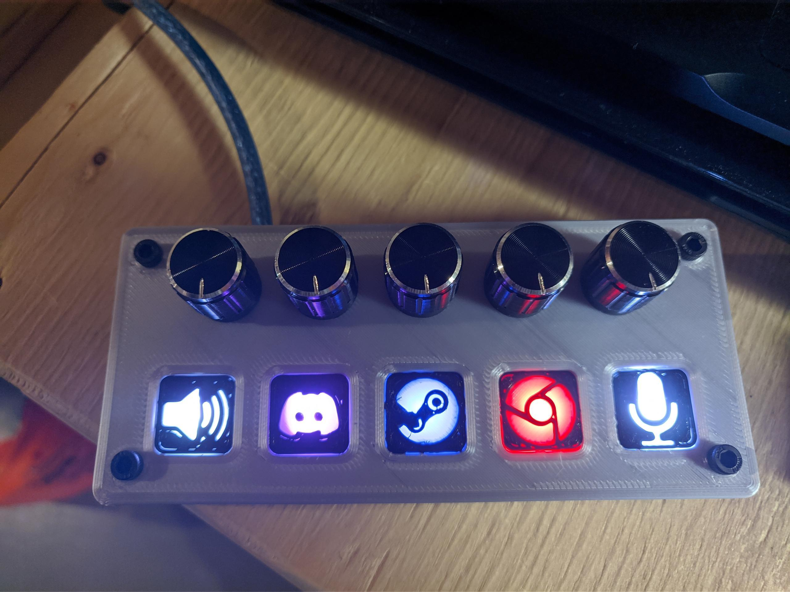

## bgrier

**Links**: [Imgur album](https://imgur.com/a/2LFaeVV) | [Full Instructable](https://www.instructables.com/Arduino-Keyboard-Joystick-Extender-Box-and-Sound-C/)

This particularly special build will appeal to those who love analog controls (so everyone, yes?). It is a hybrid of deej together with a fully functional joystick controller! The creator is using it as a keyboard extender that can control certain interface elements, or certain things in games and simulators - but really, sky's the limit. The 3D-printed body has been designed and fabricated to match the color aesthetic of the creator's keyboard, and looks like a natural extension of its frame. As a bonus, bgrier has prepared a fully detailed Instructable for any of you who want to follow along and build it (link above). Oh, and even if you don't need a joystick, the fidget value is just incredible!

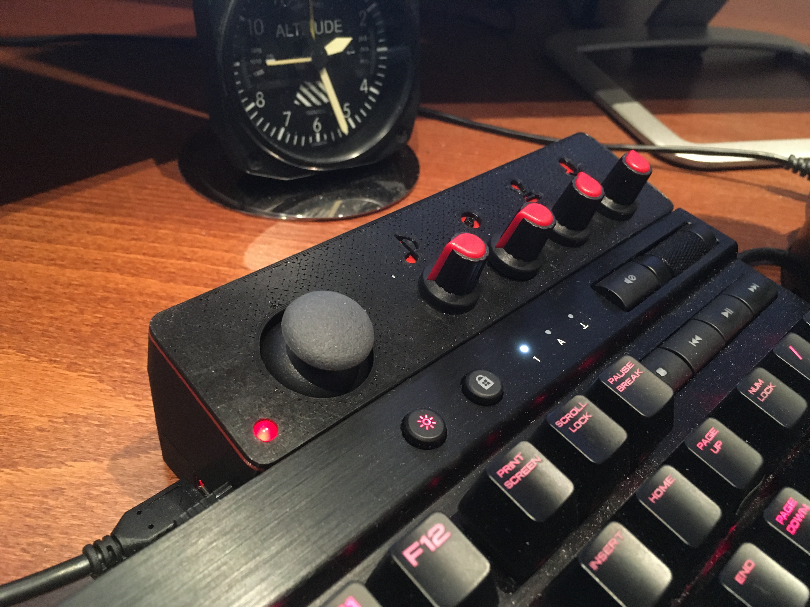

## marcioasf

**Links**: [Imgur album](https://imgur.com/a/J6UNBDB)

This design is based on the above build by [Optagon](#optagon). The author chose to use 3D-printed knobs, and also printed the bottom part of the case with a translucent filament which lets the LED inside add a pleasant, diffused glow to its exterior.

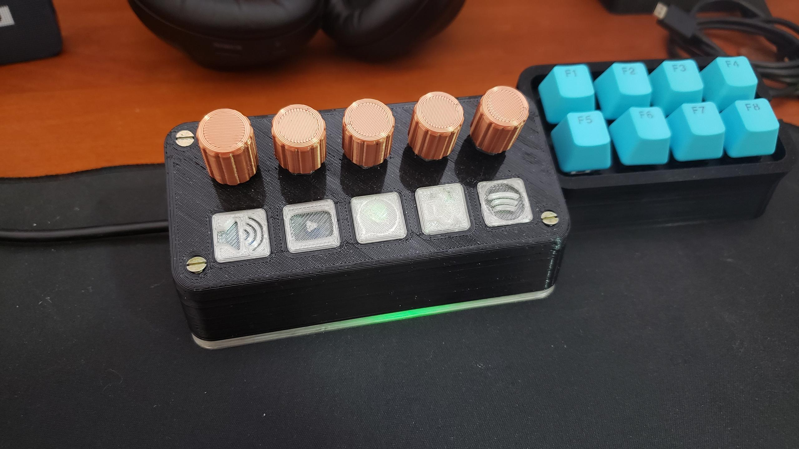

## Bao

**Links**: [Imgur album](https://imgur.com/a/hrw3TvZ)

This incredibly creative design brings deej to life on a tiny Mentos can. Novelties aside, this build ends up with a very compact footprint and can be a fantastic idea for anyone without access to a 3D printer. Looks tough to wire up, but if you're building with a Mentos can you _clearly_ know what you're doing.

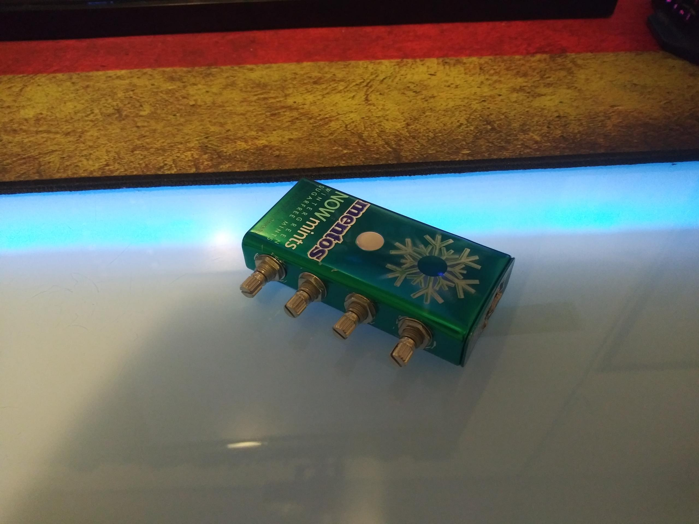

## AbbyTheGryphon

**Links**: [Imgur album](https://imgur.com/a/USUAesF) | [Enclosure model on MyMiniFactory](https://www.myminifactory.com/object/3d-print-139957)

This design incorporates an amp-style appearance with a personalized touch. The five rotary potentiometers use plastic dials with a shiny metallic top, which adds a lot to that look. Additionally, tiny markings underneath each knob indicate the travel range for the pot. Crank it up to 11 with this one!

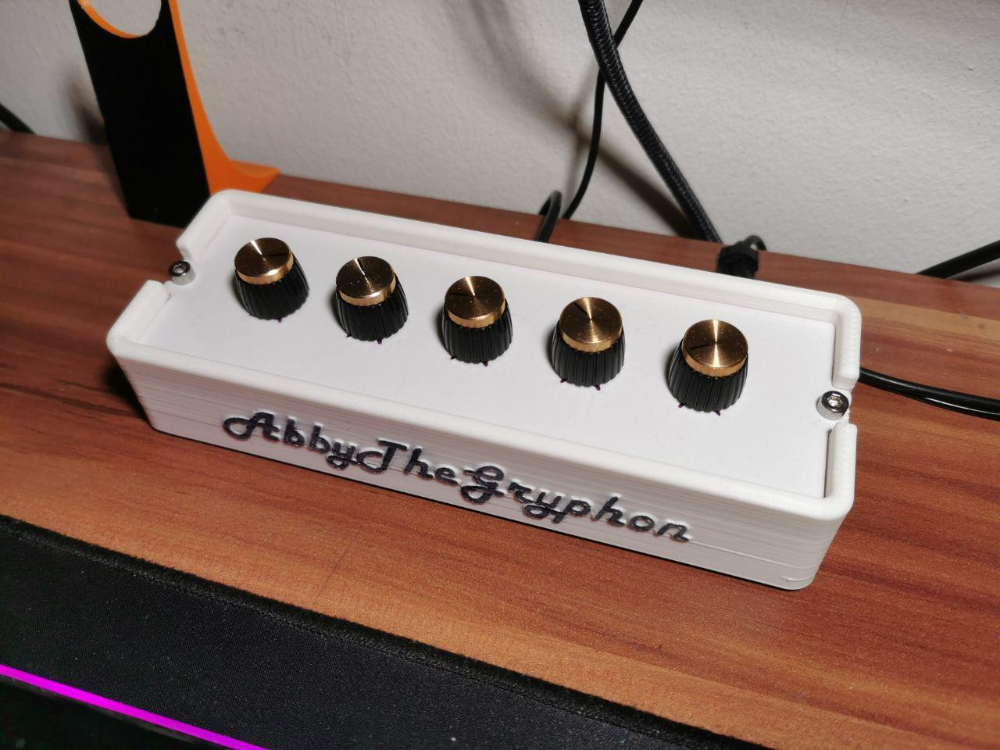

## T-po

**Links**: [Imgur album](https://imgur.com/a/OuYZDQk)

This elegant build achieves its polished, professional look by using a project case to mount its top-facing components. It uses five identical rotary potentiometers, with the shiny aluminum knobs differentiating between the master knob and the other channels. It also features a mini USB to micro USB adapter (which makes up for the Nano's most glaring downside). The creator included some descriptions and part names in their Imgur album (link above).

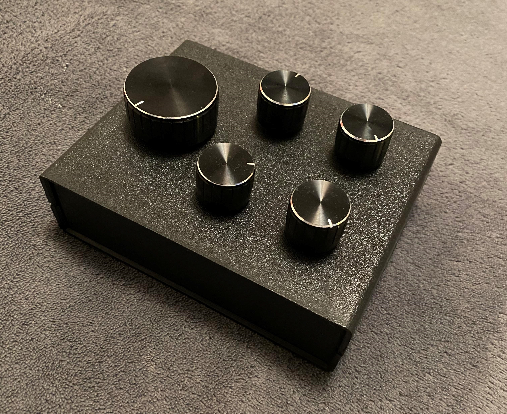

## [Imagine Fabrication Lab](https://www.instagram.com/imaginefabricationlab/)

**Links**: [Imgur album](https://imgur.com/a/o8nZHDc) | [Enclosure model on Thingiverse](https://www.thingiverse.com/thing:4639592)

This design was made with power users in mind, incorporating no less than 12 buttons to trigger custom functionality with the Arduino Pro Micro's keyboard emulation capabilities (this requires a modified deej firmware). The 3D-printed buttons are mounted with a press fit, and can be swapped out as desired. Finally, these 45mm sliders offer a good amount of precision without taking up much space, resulting in a build that's fairly compact for the amount of firepower it packs.

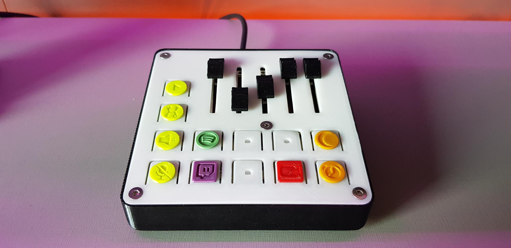

## [omnisai](https://relivesight.com/)

**Links**: [Imgur album](https://imgur.com/a/Z5luqwl) | [Blog entry!](https://relivesight.com/projects/encoder/) | [One more build by the author](https://relivesight.com/projects/deejx2/)

Another entry in the list of power-user oriented builds, this one-of-a-kind design was made from the case of a Behringer audio interface that its owner was willing to sacrifice. They added a fresh coat of paint, replaced the original components and made it into a thing of beauty. This build features no less than 9 potentiometers and 18 buttons, taking full advantage of everything the Arduino Pro Micro has to offer. The creator wrote a highly detailed blog post about the process on their website, I recommend giving it a read (link above)!

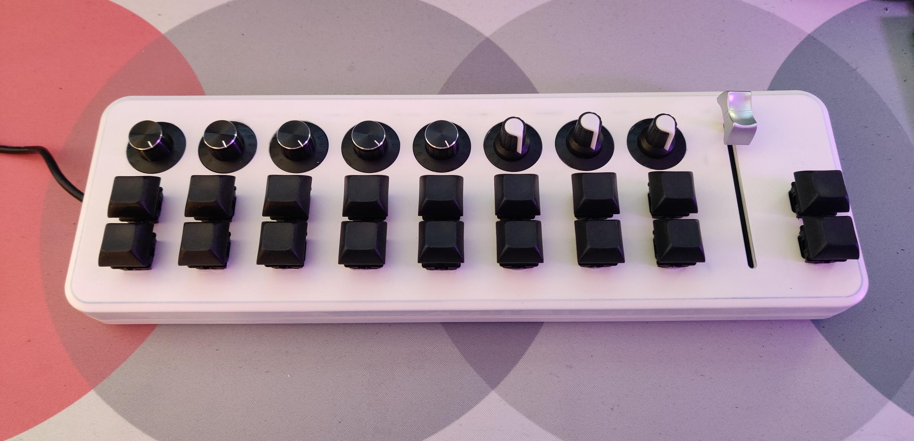
