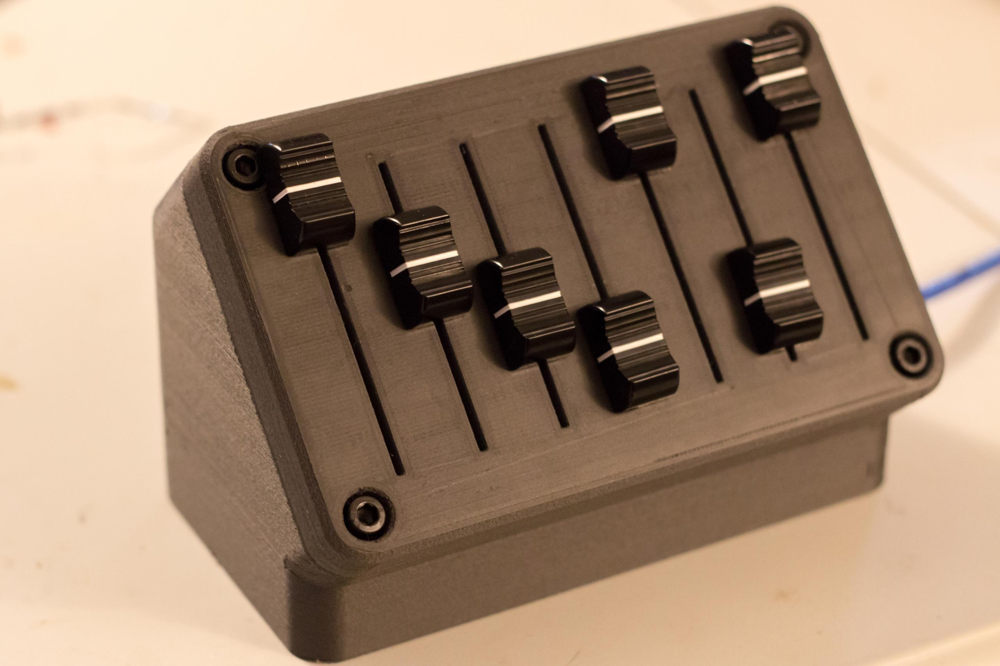

# Community showcase

This is a showcase of `deej` versions built by people around the world. Many of those who featured their builds here regularly hang around in [our Discord server](https://discord.gg/nf88NJu), so you can ask them any questions you might have.

We've also gathered many of the community-created 3D designs featured here in a [Thingiverse collection](https://thingiverse.com/omriharel/collections/deej) for your viewing pleasure. Feel free to use them for your own builds if you have access to a 3D printer.

If you built yourself one of these things, I'd love to [add yours](https://discord.gg/nf88NJu)!

## [/u/Aithorn](https://reddit.com/user/Aithorn)

**Links**: [Imgur album](https://imgur.com/a/Y1rKJmc) | [Reddit](https://redd.it/fc2l3x) | [Enclosure model on Thingiverse](https://www.thingiverse.com/thing:4196719) | [Featured on Arduino Blog!](https://blog.arduino.cc/2020/03/04/control-the-volume-of-programs-running-on-your-windows-pc-like-a-dj/) | [Alternate knobs](https://i.imgur.com/WjaA58d.jpg)

This build features a very neat 3D-printed enclosure to fit the sliders, and uses an Arduino Nano board.

## [Bupher](https://github.com/Bupher)

**Links**: [Imgur album](https://imgur.com/a/Rwq0ynd) | [Enclosure model on Thingiverse](https://www.thingiverse.com/thing:4237483) | [GitHub fork](https://github.com/Bupher/deej)

This build uses circular knobs instead of sliders, and adds a 7-segment display showing the volume of the last adjusted knob. It also adds functionality to allow designating a knob to control the volume of whichever application is currently in focus. Those changes are available in Bupher's fork (link above).. Very cool!

## Dimitar

**Links**: Schematic ([.png](./assets/community-builds/extra/dimitar-schematic.png) | [.sch](./assets/community-builds/extra/dimitar-schematic.sch))

This build, based on the above 3D-printed enclosure by [/u/Aithorn](#uaithorn), adds onto it with additional holes drilled for fading LEDs and mute toggles. Their wiring is detailed in the schematic that Dimitar has kindly provided (link above).. The sleek dark appearance, coupled with the differently colored knobs and LEDs, makes for a very professional look.

## [/u/jeremytodd1](https://reddit.com/user/jeremytodd1)

**Links**: [Imgur album](https://imgur.com/a/ys1RLwr)

This build is based on the above 3D-printed enclosure by [/u/Aithorn](#uaithorn) and also uses their 3D-printed knobs for its sliders.

## CptnObvious

**Links**: [Imgur album](https://imgur.com/a/pnptoo7)

This build uses a flat 3D-printed enclosure, but the real kicker is its magnetically-snapping application logo covers, made with a midway-filament-swapping technique. Looking snappy!

## nightfox939

**Links**: [Imgur album](https://imgur.com/a/rrLbTHI) | [Enclosure model on Thingiverse](https://www.thingiverse.com/thing:4460296)

This build takes a different spin on 3D-printed enclosures by positioning the sliders at an angle, such that the box can be placed right behind the keyboard (as shown [here](https://i.imgur.com/FuvaaTO.jpg)). It also features seven sliders, which is fantastic for power users.

## [Snackya](https://github.com/Snackya)

**Links**: [Imgur album](https://imgur.com/a/ZL6UBuR) | [GitHub repository with PCB files and instructions](https://github.com/Snackya/Snackboard-mix)

This one's a very special build, as it's designed to look great with absolutely no 3D printing, mill or any casing at all. It's made with custom PCBs that are mounted together with bolts and nuts. The top plate's silkscreen layer adds its own visual flair. The build uses six 100 mm sliders and an Arduino Pro Micro. Snackya has kindly provided the gerber files, as well as detailed instructions, in their GitHub repository (link above).

## [olijoe](https://github.com/olijoe)

**Links**: [Imgur album](https://imgur.com/a/Wibnqi7) | [GitHub repository with PCB files and instructions](https://github.com/olijoe/Deej-board)

This PCB build also takes advantage of sandwiching between two identical custom PCBs to avoid any need for 3D printing or other tools. Both sides of the PCB are used, one for mounting and wiring the components and the other for the silkscreen design (which in this case features some app logos and a cute geometric alpaca). olijoe has kindly provided the gerber files, as well as detailed insturctions, in their GitHub repository (link above).

## [Daggr](https://www.thingiverse.com/daggr)

**Links**: [Imgur album](https://imgur.com/a/YmTALay) | [Enclosure model on Thingiverse](https://www.thingiverse.com/thing:4555424) | [Blog post](https://blogg.spofify.se/index.php/2020/07/28/physical-volume-controller-part-2/)

This design is a remixed version of the above build by [nightfox939](#nightfox939), this time using five circular knobs instead of sliders. It adds onto it with a patterned top infill in the slicer settings, as well as some sharp looking filament-swapped app icons.

## [/u/thesqueakywheel](https://reddit.com/user/thesqueakywheel)

**Links**: [Imgur album](https://imgur.com/a/vTsrSa7) | [Enclosure model on Thingiverse](https://www.thingiverse.com/thing:4557639)

This one's a compact 3-part design made to be [mounted to the underside of a desk](https://i.imgur.com/hGB5NH2.png). Each part is flat to allow for easy 3D printing without support material. The design is made such that the mounting plate in-between the two covers is actually what's holding them together and hidden between them for a seamless packaging.

## [Optagon](https://www.thingiverse.com/Optagon)

**Links**: [Imgur album](https://imgur.com/a/8WKr8W9) | [Enclosure model on Thingiverse](https://www.thingiverse.com/thing:4556291)

This design incorporates fading LEDs that shine through 3D-printed app icons (they look way better in reality, but hopefully the picture gives a bit of an idea). Instructions for how to wire everything up, including some pictures, are inside the links above. A bright idea, and some very stylish execution!

## mozza

**Links**: [Imgur album](https://imgur.com/a/KnWkJCS) | [Enclosure model on Thingiverse](https://www.thingiverse.com/thing:4558424)

This compact build was designed to be positioned side-by-side with a keyboard, [as shown here](https://i.imgur.com/cfqV8t5.jpg). Contrary to most other designs, the knobs here are laid out vertically, making ideal use of the space they occupy. Perfect for a quick adjustment without ever taking off your hand from that side of the keyboard!

## Max

**Links**: [Imgur album](https://imgur.com/a/T8OR4b3)

This build uses laser-cut acrylic as for its top plate which results in an absolutely stunning shine. It's lined with LEDs to indicate mute state, controllable by one of the two rows of buttons. The second row is used as custom triggers for F13-F19 keys, which brings a lot of added utility. This one's definitely for power users!

## [/u/functionalism](https://reddit.com/user/functionalism)

**Links**: [Imgur album](https://imgur.com/a/zavi9jL) | [Enclosure model on Thingiverse](https://www.thingiverse.com/thing:4561669)

This build uses a 3D-printed design remixed from [/u/Aithorn](#uaithorn)'s above enclosure. This one was made to be held in place by magnets, as it's situated on top of a metallic monitor stand. Magnets are also used instead of screws to hold the top cover and the enclosure's base together. In addition, app icons have been embossed into the 3D-printed slider knobs.

