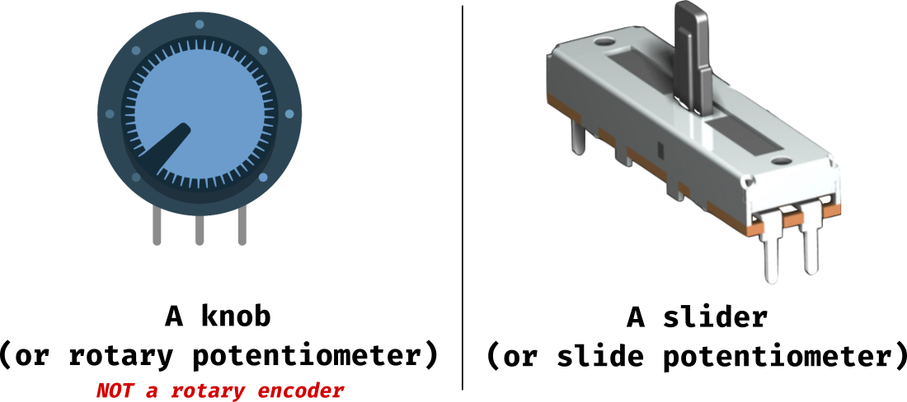
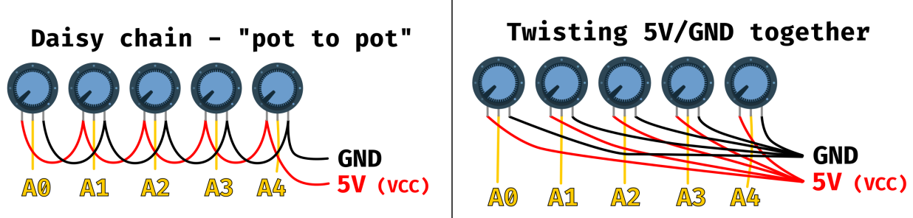

# deej FAQ

This document tries to cover all of the most commonly asked questions in our [community Discord server](https://discord.gg/nf88NJu), as well as provide basic troubleshooting for frequently-encountered problems by new deej users.

## Important - this is a **work-in-progress**!


**Please be aware that the current version of this FAQ is still _extremely_ work-in-progress.** It is released publicly in hopes that the questions already answered can be useful to some.

**All questions that have a complete answer have been marked with a "✔" in the table of contents, for your convenience.**

> Please also be aware that I am currently _not accepting_ GitHub contributions in the form of fully submitted answers to the unanswered questions below. You are welcome to submit them (alongside any other feedback) on our community Discord, however!

## Table of Contents

Use the following list of questions to quickly jump to what you're looking for.

> Can't find what you're looking for? Try searching for terms with a hashtag, such as _**#rotaryencoders**_. These are located near each question for easier finding of alternative keywords.

[**Electronics and hardware**](#electronics-and-hardware)

- **Parts & components**
  - [Which board should I get?](#which-board-should-i-get)
  - [What is the difference between sliders and knobs?](#what-is-the-difference-between-sliders-and-knobs) ✔
  - [Does the resistance of my pots matter? Do they need to be 10K?](#does-the-resistance-of-my-pots-matter-do-they-need-to-be-10k) ✔
  - [What are rotary encoders and can I use them instead of pots?](#what-are-rotary-encoders-and-can-i-use-them-instead-of-pots?)
- **Wiring**
  - [How should I **physically** wire my pots together?](#how-should-i-physically-wire-my-pots-together)
  - [How should I **logically/electronically** wire my pots together?](#how-should-i-logicallyelectronically-wire-my-pots-together) ✔
  - [How can I tell which pin is which on my sliders?](#how-can-i-tell-which-pin-is-which-on-my-sliders)
- **Extra hardware features**
  - [How do I add mute switches/toggles for each pot?](#how-do-i-add-mute-switchestoggles-for-each-pot)
  - [How do I add LED indicators?](#how-do-i-add-led-indicators)
  - [How do I add custom macro buttons?](#how-do-i-add-custom-macro-buttons)
  - [How do I add a toggle between output devices?](#how-do-i-add-a-toggle-between-output-devices)


[**Arduino**](#arduino)

- [I haven't used Arduino before, where to start?](#i-havent-used-arduino-before-where-to-start) ✔
- [How can I find my COM/serial port?](#how-can-i-find-my-comserial-port) ✔
- [How can I upload the deej sketch to my board?](#how-can-i-upload-the-deej-sketch-to-my-board) ✔
- [How do I know that I uploaded the deej sketch correctly?](#how-do-i-know-that-i-uploaded-the-deej-sketch-correctly) ✔
- I'm unable to connect to my board in the Arduino IDE...
  - [...for the first time ever](#for-the-first-time-ever) ✔
  - [...after connecting successfully in the past](#after-connecting-successfully-in-the-past) ✔
- [How do I view the serial monitor?](#how-do-i-view-the-serial-monitor) ✔

[**Running deej for the first time**](#running-deej-for-the-first-time)

- [What should I check before running deej.exe?](#)
- [I ran deej.exe but nothing happened](#)
- I ran deej.exe and got an error message...
  - [...about the config.yaml file](#)
  - [...about failed connection](#)
- [I turn my pots but nothing happens](#)
- [I ran deej.exe and my volume keeps jumping around](#)
- [My pots only seem to go up to around half volume](#)
- [All of my pots are inverted!](#all-of-my-pots-are-inverted) ✔
- [One of my pots is inverted](#one-of-my-pots-is-inverted) ✔

[**Editing the config file (config.yaml)**](#editing-the-config-file-configyaml)

- [How do I open and edit the config.yaml file?](#how-do-i-open-and-edit-the-configyaml-file) ✔
- [How can I check my config.yaml for errors?](#how-can-i-check-my-configyaml-for-errors) ✔
- [How do I add an app to the config.yaml file?](#how-do-i-add-an-app-to-the-configyaml-file) ✔
- [How can I find the .exe name of `insert app here`?](#how-can-i-find-the-exe-name-of-insert-app-here) ✔


[**Everyday deej usage**](#everyday-deej-usage)

- [Is there a way to make the volume go up/down by less than 3%?](#)
- [Can I put all my games on one slider without needing to add them one-by-one?](#can-i-put-all-my-games-on-one-slider-without-needing-to-add-them-one-by-one) ✔
- [The edges of my slider aren't as responsive as the middle](#)
- [How can I make deej start automatically when my PC boots?](#)
- [After my computer wakes up from sleep/hibernation deej doesn't work anymore](#)
- [Sometimes deej randomly stops working (without sleep/hibernation)](#)

[**Component housings and enclosures**](#component-housings-and-enclosures)

- [I don't have a 3D printer, can I still make this project?](#)
- [I have a 3D printer - where can I find a design to print?](#)

[**[↑]**](#deej-faq)

## Electronics and hardware

### What is the difference between sliders and knobs?

As long as you're referring to pots - nothing. The only difference is that one of them rotates while the other slides. Electrically, they work exactly the same and they're purely up to personal preference.



<sub>_Tags: #potentiometers, #pots, #sliders, #rotarypots, #knobs_</sub>

[**[↑]**](#deej-faq)

### Does the resistance of my pots matter? Do they need to be 10K?

In short: **no, it doesn't matter.** Any resistance will work.

Longer explanation: deej uses potentiometers as voltage dividers between a 5V pin and a GND pin. Since each analog pin (the pin connected to the pot's wiper) has its own "circuit", each pot is treated as its own voltage divider and is always the only resistor across that circuit. This also means that some of your pots can have one resistance and other ones a different one. It just makes no difference in the context of this project. [Here's a great video](https://www.youtube.com/watch?v=fmSC0NoaG_I) if you're interested in learning more about voltage dividers.

<sub>_Tags: #pots, #resistance, #10k, #ohm_</sub>

[**[↑]**](#deej-faq)

### How should I logically/electronically wire my pots together?

There are two main options to wire your pots between one another.

- The first is to "daisy chain" them (left) - each pot's positive pin connects to next pot's positive pin, with the last one going to the board. The same goes for the negative pins. You'll need to cut your wires to size for this to look good.
- The second way is to just bring out a separate wire from each pot, and twist together the _exposed_ ends to one wire (which then goes to the board). This is also done one for all the positive pins, and once for all the negative pins. This method is a bit easier to do if you have thin, flexible wires.

> **Note:** these drawings can also be followed with sliders (slide potentiometers) - rotary pots are used here as an example.



<sub>_Tags: #wiring, #potentiometers, #pots, #sliders, #rotarypots_</sub>

[**[↑]**](#deej-faq)

## Arduino

### I haven't used Arduino before, where to start?

First off, know that you're in the right place. This project is excellent for a total beginner without any electronics or Arduino knowledge. That being said, you are expected to learn some basics along the way. Here's a general suggestion for how to proceed:

- Watch an introductory video explaining the basics of Arduino, such as [this excellent one](https://www.youtube.com/watch?v=nL34zDTPkcs).
- Determine what type of deej build you want to go for (3D-printed or not, knobs or sliders, how many of them, etc.), according to your preferences
  - If this is your first electronics project, I wholeheartedly recommend to keep things simple and not add additional custom functionality. You can always add these later on (or build a second, third and fourth deej!)
- Get some inspiration from our [community showcase](https://showcase.deej.rocks) and [Thingiverse design collection](https://thingiverse.com/omriharel/collections/deej)
- Become somewhat familiar with how deej works. A great way to do this is to read the [how it works](https://github.com/omriharel/deej#how-it-works) section in the main README, or to simply read through most of this FAQ :)
- Once you feel like you have a decent grasp over how deej works and what components you need, get shopping!
  - If you're doing things for the first time, it's a good idea to get a spare or two (at least for things like your board and pots) in case you mess something up. It's unlikely, but who wants to wait for a part twice as long?
- When your parts arrive, take some time to brush up and make sure you understand how you should wire everything together. You can always undo some of it, but taking a brief refresher at this point might save you some time
- If you run into issues or have additional questions (especially if they're not covered here), join our [community Discord server](https://discord.gg/nf88NJu) and ask away!

<sub>_Tags: #beginner, #noob, #newbie, #firsttime_</sub>

[**[↑]**](#deej-faq)

### How can I find my COM/serial port?

**Windows users:**

In most cases, you would be able to see your device in the Arduino IDE, under the _Tools_ → _Port_ menu.

> _Note:_ `COM1` is reserved for use by the operating system, and very likely isn't the port of your board. If this is the only option you're seeing, your computer isn't properly detecting your board (see [here](#for-the-first-time-ever) for possible causes).

Another option for Windows users is to open the Device Manager (right-click the Start icon and choose _Device Manager_) and look under _Ports (COM & LPT)_. In most cases this will show the same list as the Arduino IDE, however.

**Linux users:**

Generally speaking, you'll be able to find your serial port by listing your serial devices with a command such as `ls /dev/ttyUSB*` and choosing the one that makes the most sense. You can also disconnect your device, run the command again and compare both outputs to find the one that's now missing.

> Please keep in mind that deej's config.yaml file requires you to use the full path, such as `/dev/ttyUSB1`.

<sub>_Tags: #comport, #serialport, #devicemanager_</sub>

[**[↑]**](#deej-faq)

### How can I upload the deej sketch to my board?

- Start by downloading the vanilla deej sketch from [this URL](https://raw.githubusercontent.com/omriharel/deej/master/arduino/deej-5-sliders-vanilla/deej-5-sliders-vanilla.ino), either by right-click → _Save as..._ (save the file with an `.ino` extension), or simply copying and pasting its entire contents into the Arduino IDE (replacing the current open sketch).
- The vanilla sketch is meant for use with 5 potentiometers, wired to analog pins `A0` to `A4`: `A0, A1, A2, A3, A4`. If you have more or less potentiometers, or they're wired to different analog pins on your board, you will need to modify the sketch to reflect those differences. You should do this _before_ uploading it to the board. To do this:
  - Change the number of pots on the first line of the sketch
  - Change the array of pin numbers on the second line of the sketch
  - For example, if you only need 3 pots and you wired them to `A1`, `A3` and `A5` your code would look like this:

```cpp
const int NUM_SLIDERS = 3; // instead of 5
const int analogInputs[NUM_SLIDERS] = {A1, A3, A5}; // instead of A0-A4
```

- Make sure that you've selected the correct COM port, board type and processor according to the board you're using, and that your board is connected to the computer.
- Upload the sketch by clicking the _Upload_ button in the Arduino IDE's top menu bar. This should take between 5 and 15 seconds to complete.

<sub>_Tags: #arduino, #arduinoide, #sketch, #flash, #upload, #board_</sub>

[**[↑]**](#deej-faq)

### How do I know that I uploaded the deej sketch correctly?

The best way to tell is to check the Serial Monitor in Arduino IDE right after your upload has completed. If it displays a steady stream of numbers, separated by the pipe (`|`) character, you've correctly uploaded the deej sketch.


There are several things you want to note here:

- Each line contains a total amount of numbers equal to how many potentiometers you have defined in the sketch you uploaded.
  - The above screenshot, for instance, represents 6 sliders. The last line doesn't count, it's still being written!
- Each number corresponds to a certain pot, from left to right. Its value is a number between 0 and 1023, where 0 means "the pot is at 0%" and 1023 means "the pot is at 100%".
  - In the above screenshot:
    - the first pot sits at about 50%
    - the second and fourth pots are slightly below that
    - the third pot is slightly above that
    - the fifth and sixth pots are at 100%
- Try moving your pots! They should behave as explained above, with each one being adjustable between the range of 0 and 1023. If this isn't the case, you might have miswired your potentiometers.
- Analog values from pots are slightly different between lines, even when the pot isn't being moved. **This is normal!** Since this is an analog signal, it is subject to some noise and interference. deej internally manages that to ensure that volume only changes when you mean to change it.
  - If your analog values are "jumping" by a significantly larger margin than shown here, you may have miswired your potentiometers.

If your serial monitor appears to be similar to this, and behaves correctly when you move all of your pots, you're good to go! Close the serial monitor, and proceed to [download and set up](https://github.com/omriharel/deej/releases/latest) deej's desktop client and its config.yaml file.

<sub>_Tags: #arduino, #arduinoide, #sketch, #flash, #upload, #board, #verify_</sub>

[**[↑]**](#deej-faq)

### I'm unable to connect to my board in the Arduino IDE...

#### ...for the first time ever

You might be **missing drivers** that correspond to your board. This is of course going to depend on which board you got (with most drivers being automatically detected and installed by your OS), but a very common driver that cheaper Nano-like boards use is the CH340.

> Please keep in mind that you should only use drivers provided or instructed by your board's manufacturer. Installing drivers from a third-party website is at your own risk.

Another common issue with some older Nano-like boards is simply **choosing the wrong processor** in the Arduino IDE, thus not being able to properly communicate with the board (despite setting the correct COM port). In this case, try choosing the **Old Bootloader** option under _Tools_ → _Processor_. You might have to restart your Arduino IDE after.

<sub>_Tags: #connectionissue, #connectionerror, #arduinoide, #accessdenied, #unabletoconnect, #board_</sub>

[**[↑]**](#deej-faq)

#### ...after connecting successfully in the past

First, **check that you've set the [correct COM/serial port](#how-can-i-find-my-comserial-port)** in Arduino IDE. Sometimes (especially during initial setup) this port will change between cable/USB port disconnects and reconnects.

Secondly, is anything else running on your machine that might be already connected to the serial port? **Only one thing can be connected to the same serial port at the same time!** Some common culprits include:

  - Cura, a popular 3D slicing software
  - Another instance of Arduino IDE
  - and of course, deej itself!

<sub>_Tags: #connectionissue, #connectionerror, #arduinoide, #accessdenied, #unabletoconnect, #board_</sub>

[**[↑]**](#deej-faq)

### How do I view the serial monitor?

First, ensure that no other program (besides Arduino IDE) is connected to the board's serial port. _This includes closing deej, in case it's already running._ Secondly, make sure that you've correctly selected the COM port in the Arduino IDE under _Tools_ → _Port_.

At that point, you should be able to go to _Tools_ → _Serial Monitor_ in the Arduino IDE (or simply use the keyboard shortcut, <kbd>Ctrl</kbd> + <kbd>Shift</kbd> + <kbd>M</kbd>). You should now see the serial output from your board!

<sub>_Tags: #serialmonitor, #arduino, #output, #arduinoide_</sub>

[**[↑]**](#deej-faq)


## Running deej for the first time

### All of my pots are inverted

This can happen if you wire their two GND/5V ends opposite to how you'd expect them to work. If you don't want to resolder anything, you can also set the `invert_sliders` option in the config.yaml file to `true`.

> Please keep in mind that if you wired hardware switches to cut power to your sliders (for a purpose like mute toggling), it would instead be treated as sending 100% volume. In this case, you'll need to resolder your pots or modify the Arduino code (and not use `invert_sliders`).

<sub>_Tags: #pots, #sliders, #invert, #reverse_</sub>

[**[↑]**](#deej-faq)

### One of my pots is inverted

In this case, simply flip the two power pins on the single problematic pot. You can also modify the arduino code to only invert that pot's value, but you probably shouldn't.

<sub>_Tags: #pots, #sliders, #invert, #reverse_</sub>

[**[↑]**](#deej-faq)

## Editing the config file (config.yaml)

### How do I open and edit the config.yaml file?

The `config.yaml` file is a simple text file, and can be edited with _any text editor_. The simplest one on Windows is **Notepad**, but you can use a more advanced editor like **Notepad++** or **Visual Studio Code** if you prefer.

> **To open the file with Notepad:**
> 1. Right-click the `config.yaml` file
> 2. Choose "Open with"
> 3. In the window that opens, double-click Notepad

<sub>_Tags: #config, #configuration, #edit, #open, #yaml_</sub>

[**[↑]**](#deej-faq)

### How can I check my config.yaml for errors?

You can easily make sure that your config.yaml is correctly structured. Just open a website such as [this one](https://codebeautify.org/yaml-validator), and paste your file contents into it. If there are errors, the website will also point out where they are.

<sub>_Tags: #config, #configuration, #check, #validate, #yaml, #formatting_</sub>

[**[↑]**](#deej-faq)

### How do I add an app to the config.yaml file?

Adding apps to the config.yaml file is simple. Start by [opening the file](#how-do-i-open-and-edit-the-configyaml-file) and pay attention to the `slider_mapping` section in it:

```yaml
slider_mapping:
  0: master
  1: chrome.exe
  2: spotify.exe
  3:
    - pathofexile_x64.exe
    - rocketleague.exe
  4: discord.exe
```

> **Important:** the slider numbers in the config start from 0, and **shouldn't be changed** depending on which pins are used. They are **always** from 0 to (however many sliders you have - 1).

To change which app (or apps) are bound to each slider, simply add their process (.exe) name under the relevant slider's number. In this above example:

- Slider #1 is bound to `master` (controls the master volume)
- Slider #2 is bound to Google Chrome
- Slider #3 is bound to Spotify
- Slider #4 is bound to **both** Path of Exile and Rocket League. You can add as many different apps as you wish to a single slider!
- Slider #5 is bound to Discord

Other than defining groups of apps, you can use other powerful options in your `slider_mapping`. Most notably:

- `deej.current` will change the volume for the currently active window
- `deej.unmapped` will group together all apps that aren't bound to a slider. This is perfect for a slider to control all your games!
- `mic` can be used to control the _input_ volume of your microphone.

> You can check out a complete list of configuration file options [here](https://github.com/omriharel/deej#slider-mapping-configuration).

<sub>_Tags: #app, #config, #configuration, #add, #set_</sub>

[**[↑]**](#deej-faq)

### How can I find the .exe name of `insert-app-here`?

If you're not sure what's the .exe name for the app you wanna add to deej's config.yaml file, you have a few options for how to find it.

**Option 1: Task Manager**

1. Open Task Manager (Ctrl+Shift+Esc)
2. Under the "Processes" tab, find the application you care about
3. Click the expand (>) button left of its name
4. Find the application name in the expanded view, and right-click it
5. Click "Go to details"
6. The process name should now be highlighted in the "Details" tab

In some cases, the app you're chasing is playing audio from a secondary process with a different name. This can be harder to find with Task Manager. But there are more ways!

**Option 2: Run deej in debug mode**

Keep in mind that this is a bit more complicated. You'll need to start by grabbing the debug executable of deej (`deej-debug.exe`) from the [releases page](https://github.com/omriharel/deej/releases) and downloading it to the same location where your deej.exe and config.yaml are:


After this, click the address bar and type `cmd.exe` then hit Enter. A command prompt window will open.


Before you continue, make sure to **quit deej if it's already running** in your tray!


At this point, make sure that your desired app is playing some audio, and then type `deej-debug.exe` in the newly opened command prompt and hit Enter. Take a moment to observe the printed logs from deej - you might need to do a bit of scrolling to find what you're looking for. Here's an example screenshot illustrating what to look for:


<sub>_Tags: #app, #exe, #process, #name_</sub>

[**[↑]**](#deej-faq)

## Everyday deej usage

### Can I put all my games on one slider without needing to add them one-by-one?

Yes. You can use the `deej.unmapped` option to bind all apps that aren't bound elsewhere in the config.yaml file. This can be used on its own, or together with other binding options on the same slider.

<sub>_Tags: #games, #unmapped, #unbound, #onebyone_</sub>

[**[↑]**](#deej-faq)

## Component housings and enclosures

[**[↑]**](#deej-faq)
